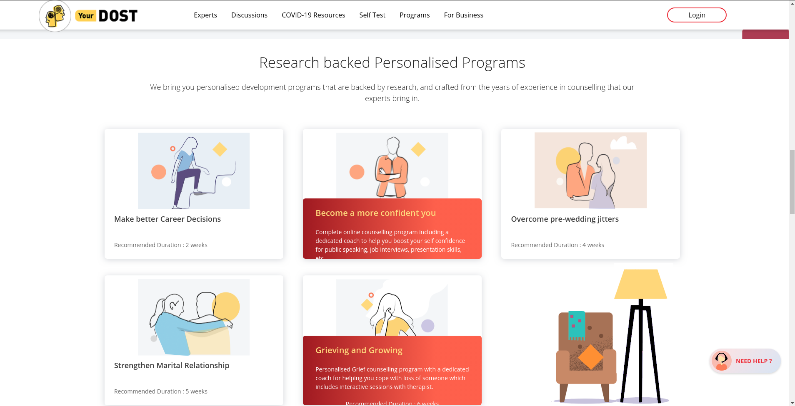

# Replica of Yourdost.com with UI changes (front-end)
### Instructions
- Copy the files in a folder.
- Install Visual Studio Code editor.
- Install Live server extension.
- Open replica.html in editor.
- Right click on the file and select Open with Live Server.
- The webpage will open in a browser

### Screenshots

### Process of Replicating the Website
- Copied text of each file from website using Google Chrome Developer tools.
- Downloaded each image and graphics used in website using Google Chrome Developer tools.

### Problems faced during UI changes
- Massive code of website.
- Duplication of images' links, thus to change one image needed to find link of image in different files.
- For responsive behaviour different media queries were there so to change color of an element multiple copies of CSS selectors were needed to be searched and then changed.
- In **Latest on YourDost blog** section the images were of very low resolution and thus to change color of images some pixels were not getting identified and thus jagged color pixels were there around the text and boundary of box.
